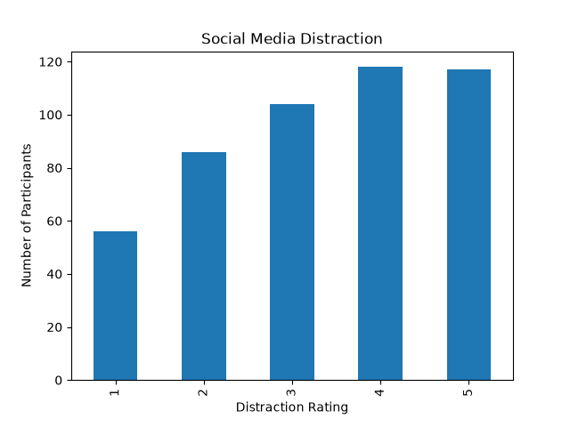
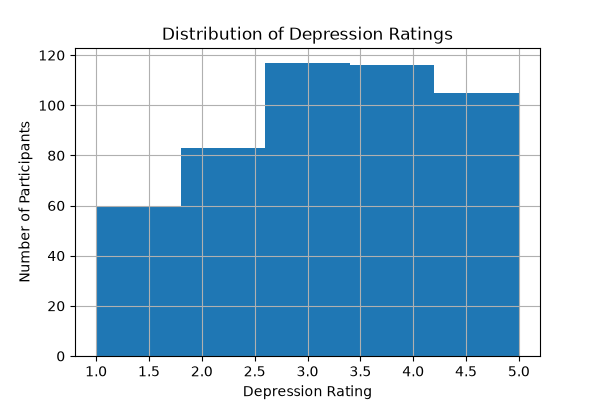
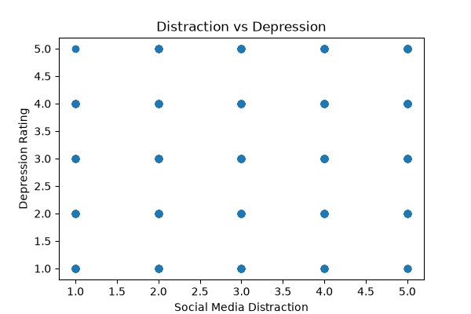
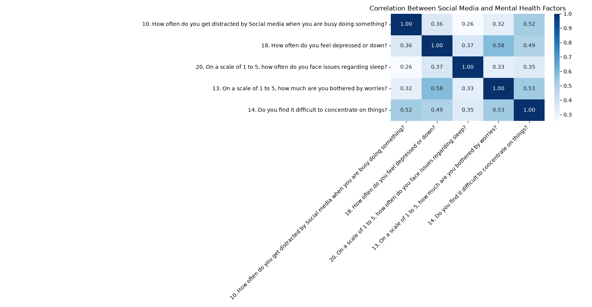

# Social Media and Mental Health Analysis
## Overview
This project explores the relationship between social media use and mental health using survey data from the Social Media & Mental Health (SMMH) dataset.
The goal was to determine whether increased social media distraction is associated with higher levels of depression and other mental health factors.

-----

## Research Question
**Is there a relationship between social media distraction and depression?**
To answer this question, I analyzed survey responses and calculated the Spearman rank correlation between distraction ratings and depression ratings.

-----

## Dataset
- Social Media & Mental Health (SMMH) survey dataset
- Responses from hundreds of participatns
- Data includes questions about:
    - Social media distraction
    - Depression
    - Sleep issues
    - Anxiety/worries
    - Difficulty concentrating

-----

## Technologies used
- Python
- Pandas
- Matplotlib
- Seaborn
- SciPy

-----

## Analysis
The project includes:
- Bar chart of social media distraction ratings
- Histogram of depression ratings
- Scatter plot comparing distraction and depression
- Correlation matrix of multiple mental health variables
- Spearman correlation analysis

-----

## Results
### Spearman Correlation
Corelation coefficient: **0.365**
P-value: **1.43 x 10^-16**
### Interpretation
The analysis found a **moderate positive correlation** between social media distraction and depression ratings.
Beacuse the p-value is faw below 0.05, the relatinship is **statistically significant**, suggesting that participants who reported being more distracted by social media also tended to report higher levels of depression.
*Note: correlation does not imply causation.*

-----
## Future Improvements
- Perform regression analysis
- Explore additional mental health variables
- Build interactive visualizations
- Create a predictive machine learning model
- Explore additional statistical tests

-----

## J.B. Crouch

-----

## Visualizations
### Scial Media Distribution Ratings

### Distribution of Depression Ratings

### Distraction vs. Depression

### Correlation Matrix

